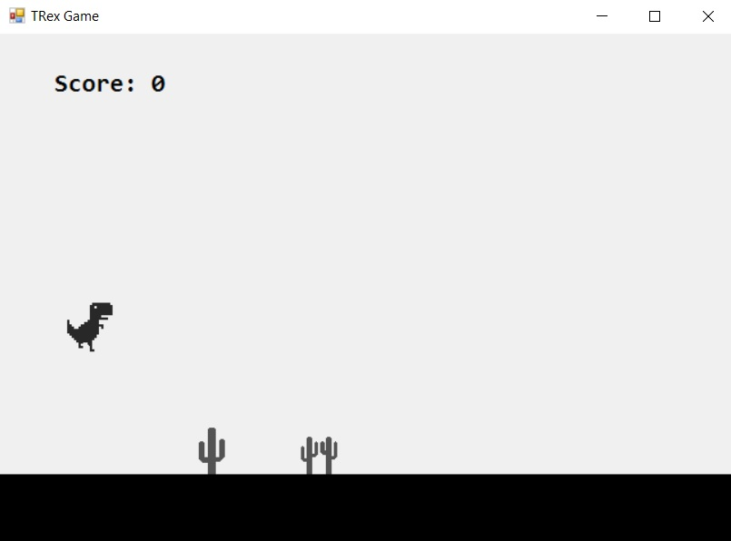

# TRexRunnerGame

# Description
T. Rex Runner Game is a desktop game about avoiding obstacles with a running dinosaur and getting the highest score possible. The difficulty level increases as you progress.

# Used design patterns

1. `Bridge` - separating the abstraction of division of units from their implementation allowing them to change independently of each other
2. `Builder` - separation of the structure of a graphical component with a complex structure from its representation. The same construction process is used to create graphics for different types of units
3. `Factory` - creating a component that supports the physics of different types of units without specifying their specific classes
4. `Singleton` - ensuring that the main character (dinosaur) has one globally available instance
5. `State` - depending on the state of the game, the dinosaur adopts a different graphic presentation
6. `Dependency Injection` - removing direct dependence between game components
7. `MVC` - division of the game into 3 components: view - View classes and graphic components responsible for display, model - classes supporting physics contain the core of the game and a controller - the main Game class that supports input and communicates with the model and view
8. `Facade` - view interface provides a simple interface for a complex class (Windows Forms)
9. `Strategy` - depending on the achieved result, the difficulty level changes
10. `Mediator` - handles game state change by calling appropriate methods

# Images

**Class diagram:** 
 
**Screenshot:** 
 